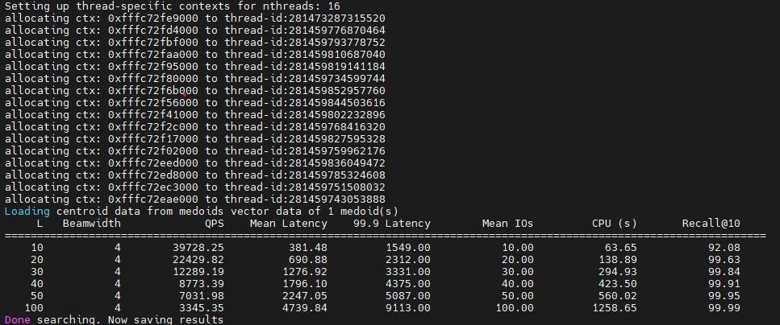

# Best Practices

## Non-Equivalence Optimization

This section describes how to test DiskANN after non-equivalence optimization on the Kunpeng platform. The test depends on the Kunpeng non-equivalence optimization patch file `0001-diskann_0.7.0-optimize-neq.patch`. The `sift1M` dataset is used as an example.

**Obtaining the Dataset and Test Program**

1. The test program is located in the `/path/to/DiskANN/perf_test` directory. The directory structure is as follows:

   ```text
   diskann/
   └── perf_test/                          // Performance benchmarking scripts
         ├── test.sh                       // Main test entry; configures bandwidth limits and executes search tests on two datasets sequentially
         ├── test_100m.sh                  // Script for building and searching the 100M × 1536-dimensional dataset
         ├── test_bge.sh                   // Script for building and searching the BGE 10M × 1024-dimensional dataset
         ├── test_sift.sh                  // Script for building and searching the SIFT dataset (supports the cache_budget parameter)
         ├── ssd-conc.sh                   // SSD IOPS concurrent stress testing script; uses fio to measure random read performance
         ├── set_fio_limit_v2.sh           // Creates the fio_limit cgroup and configures IOPS throttling
         ├── mv_shell_to_fio_limit_v2.sh   // Moves the current shell session into the fio_limit cgroup to enable bandwidth throttling
         └── mv_shell_back.sh              // Moves the current shell session back to the default blkio cgroup to remove throttling
   ```

2. Obtain datasets. Assume that the data is stored in the `/path/to/data` directory.

    ```bash
    cd /path/to/data
    wget ftp://ftp.irisa.fr/local/texmex/corpus/sift.tar.gz
    tar -xf sift.tar.gz
    ```

**Testing DiskANN After Non-Equivalence Optimization**

1. Install dependencies.

    ```bash
    apt install numactl libnuma-dev libomp-dev
    ```

2. Compile DiskANN by following the instructions in the [Installation Guide](./installation_guide.md).

   >**Note:** To test DiskANN with non-equivalence optimization, you must enable the Kunpeng-specific optimization macro during compilation: `-DFAST_DISKANN=ON`.

3. Process the dataset.

    ```bash
    cd /path/to/DiskANN/build
    ./apps/utils/fvecs_to_bin float data/sift/sift_learn.fvecs data/sift/sift_learn.fbin
    ./apps/utils/fvecs_to_bin float data/sift/sift_query.fvecs data/sift/sift_query.fbin
    ```

4. For the first execution, build the index. For subsequent runs, load the pre-built index directly for queries:

    ```bash
    cd /path/to/DiskANN/perf_test
    bash test_bge.sh /path/to/data/sift build
    ```

5. Load the built index for query.

    ```bash
    bash test_bge.sh /path/to/data/sift search
    ```

The test result is as follows:


## Equivalence Optimization

This section describes how to test DiskANN after equivalence optimization on the Kunpeng platform. The test depends on the Kunpeng equivalence optimization patch file `0002-diskann_0.7.0-optimize-eqv.patch`. The `sift1M` dataset is used as an example.

**Obtaining the Dataset and Test Program**

1. The test program is located in the `/path/to/DiskANN/perf_test` directory. The directory structure is as follows:

   ```text
   diskann/
   └── perf_test/                                                    // Performance benchmarking scripts
         ├── test.sh                                                 // Main test entry; configures bandwidth limits and executes search tests on two datasets sequentially
         ├── test_100m.sh                                            // Script for building and searching the 100M × 1536-dimensional dataset
         ├── test_bge.sh                                             // Script for building and searching the BGE 10M × 1024-dimensional dataset
         ├── test_sift.sh                                            // Script for building and searching the SIFT dataset (supports the cache_budget parameter)
         ├── ssd-conc.sh                                             // SSD IOPS concurrent stress testing script; uses fio to measure random read performance
         ├── set_fio_limit_v2.sh                                     // Creates the fio_limit cgroup and configures IOPS throttling
         ├── mv_shell_to_fio_limit_v2.sh                             // Moves the current shell session into the fio_limit cgroup to enable bandwidth throttling
         └── mv_shell_back.sh                                        // Moves the current shell session back to the default blkio cgroup to remove throttling
   ```

2. Obtain datasets. Assume that the data is stored in the `/path/to/data` directory.

    ```bash
    cd /path/to/data
    wget ftp://ftp.irisa.fr/local/texmex/corpus/sift.tar.gz
    tar -xf sift.tar.gz
    ```

**Testing DiskANN After Equivalent Optimization**

1. Install dependencies.

    ```bash
    apt install numactl libnuma-dev libomp-dev
    ```

2. Compile DiskANN by following the instructions in the [Installation Guide](./installation_guide.md).

   >**Note:** To test DiskANN with equivalence optimization, you must enable the Kunpeng-specific optimization macro during compilation: `-DFAST_DISKANN=ON`.

3. Process the dataset.

    ```bash
    cd /path/to/DiskANN/build
    ./apps/utils/fvecs_to_bin float data/sift/sift_learn.fvecs data/sift/sift_learn.fbin
    ./apps/utils/fvecs_to_bin float data/sift/sift_query.fvecs data/sift/sift_query.fbin
    ```

4. For the first execution, build the index. For subsequent runs, load the pre-built index directly for queries:

    ```bash
    cd /path/to/DiskANN/perf_test
    bash test_bge.sh /path/to/data/sift build
    ```

5. Load the built index for query.

    ```bash
    bash test_bge.sh /path/to/data/sift search
    ```

The test result is as follows:


