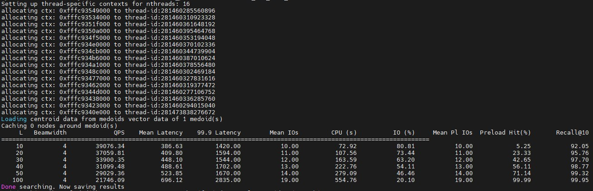

# 最佳实践

## 全量优化

本节介绍在鲲鹏平台测试全量优化后DiskANN的方法，依赖鲲鹏的全量优化补丁文件0001-diskann\_0.7.0-optimize-neq.patch。使用示例为sift1M数据集。

**获取数据集与测试程序**

1. 测试程序目录为“/path/to/DiskANN/perf_test”，目录结构应如下所示：

   ```text
   diskann/
   └── perf_test/                          // 性能测试脚本目录
         ├── test.sh                       // 主测试入口，设置带宽限制并依次运行两个数据集的搜索测试
         ├── test_100m.sh                  // 100M×1536维数据集的构建与搜索测试脚本
         ├── test_bge.sh                   // BGE 10M×1024维数据集的构建与搜索测试脚本
         ├── test_sift.sh                  // SIFT数据集的构建与搜索测试脚本，支持cache_budget参数
         ├── ssd-conc.sh                   // SSD IOPS并发压测脚本，使用fio测量随机读性能
         ├── set_fio_limit_v2.sh           // 创建fio_limit cgroup并设置IOPS限速
         ├── mv_shell_to_fio_limit_v2.sh   // 将当前shell移入fio_limit cgroup，启用带宽限速
         └── mv_shell_back.sh              // 将当前shell移回默认blkio cgroup，取消带宽限速
   ```

2. 获取数据集。假设数据存放路径为“/path/to/data”。

    ```bash
    cd /path/to/data
    wget ftp://ftp.irisa.fr/local/texmex/corpus/sift.tar.gz
    tar -xf sift.tar.gz
    ```

**全量优化后DiskANN测试**

1. 安装相关依赖。

    ```bash
    apt install numactl libnuma-dev libomp-dev
    ```

2. 请参考《[安装指南](./installation_guide.md)》编译DiskANN。

   >**说明：** 作为全量优化后DiskANN测试，需开启与鲲鹏优化相关的宏 **-DFAST\_DISKANN=ON**。

3. 处理数据集。

    ```bash
    cd /path/to/DiskANN/build
    ./apps/utils/fvecs_to_bin float data/sift/sift_learn.fvecs data/sift/sift_learn.fbin
    ./apps/utils/fvecs_to_bin float data/sift/sift_query.fvecs data/sift/sift_query.fbin
    ```

4. 若是第一次执行，需构建索引，后续加载构建好的索引进行查询。

    ```bash
    cd /path/to/DiskANN/perf_test
    bash test_bge.sh /path/to/data/sift build
    ```

5. 加载构建好的索引进行查询。

    ```bash
    bash test_bge.sh /path/to/data/sift search
    ```

测试结果如下所示：



## 等价优化

本节介绍在鲲鹏平台测试等价优化后DiskANN的方法，依赖鲲鹏的等价优化补丁文件0002-diskann\_0.7.0-optimize-eqv.patch。使用示例为sift1M数据集。

**获取数据集与测试程序**

1. 测试程序目录为“/path/to/DiskANN/perf_test”，目录结构应如下所示：

   ```text
   diskann/
   └── perf_test/                                                    // 性能测试脚本目录
         ├── test.sh                                                 // 主测试入口，设置带宽限制并依次运行两个数据集的搜索测试
         ├── test_100m.sh                                            // 100M×1536维数据集的构建与搜索测试脚本
         ├── test_bge.sh                                             // BGE 10M×1024维数据集的构建与搜索测试脚本
         ├── test_sift.sh                                            // SIFT数据集的构建与搜索测试脚本，支持cache_budget参数
         ├── ssd-conc.sh                                             // SSD IOPS并发压测脚本，使用fio测量随机读性能
         ├── set_fio_limit_v2.sh                                     // 创建fio_limit cgroup并设置IOPS限速
         ├── mv_shell_to_fio_limit_v2.sh                             // 将当前shell移入fio_limit cgroup，启用带宽限速
         └── mv_shell_back.sh                                        // 将当前shell移回默认blkio cgroup，取消带宽限速
   ```

2. 获取数据集。假设数据存放路径为“/path/to/data”。

    ```bash
    cd /path/to/data
    wget ftp://ftp.irisa.fr/local/texmex/corpus/sift.tar.gz
    tar -xf sift.tar.gz
    ```

**等价优化后DiskANN测试**

1. 安装相关依赖。

    ```bash
    apt install numactl libnuma-dev libomp-dev
    ```

2. 请参考《[安装指南](./installation_guide.md)》编译DiskANN。

   >**说明：** 作为等价优化后DiskANN测试，需开启与鲲鹏优化相关的宏 **-DFAST\_DISKANN=ON**。

3. 处理数据集。

    ```bash
    cd /path/to/DiskANN/build
    ./apps/utils/fvecs_to_bin float data/sift/sift_learn.fvecs data/sift/sift_learn.fbin
    ./apps/utils/fvecs_to_bin float data/sift/sift_query.fvecs data/sift/sift_query.fbin
    ```

4. 若是第一次执行，需构建索引，后续加载构建好的索引进行查询。

    ```bash
    cd /path/to/DiskANN/perf_test
    bash test_bge.sh /path/to/data/sift build
    ```

5. 加载构建好的索引进行查询。

    ```bash
    bash test_bge.sh /path/to/data/sift search
    ```

测试结果如下所示：


